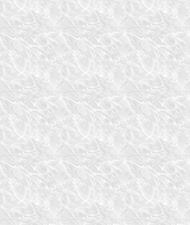
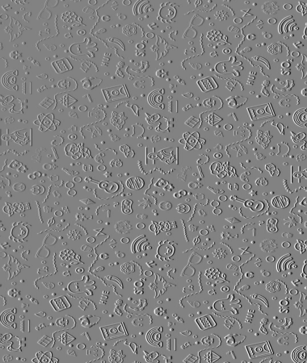
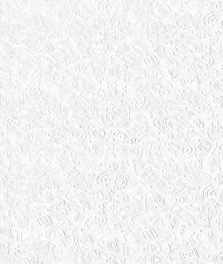

# Image Extrusion Blender
The goal is to blend an image into a background image and extrude the edges in the foreground image to make it visible after matching colors 1:1 with the background image (blending).

Algorithms of interest are Sobel edge detection and weighted sum blending.

**Resources**
* https://www.meccanismocomplesso.org/en/opencv-python-edge-detection-and-image-gradient-analysis/
* https://docs.opencv.org/3.4/d5/dc4/tutorial_adding_images.html

## Configurations
**Sobel edge detection,** optimal values:
* ksize (kernel size) =  7
* dx = 1
* dy = 0

**Weighted sum blending,** optimal values:
* Foreground weight = 55%
* Background weight = 65%
* Scalar added to each sum = 20

## Example
Background Image:

Foreground Image:

Sobel Edge Detection (Extrusion) on Foreground Image:

Final Blended Result:

